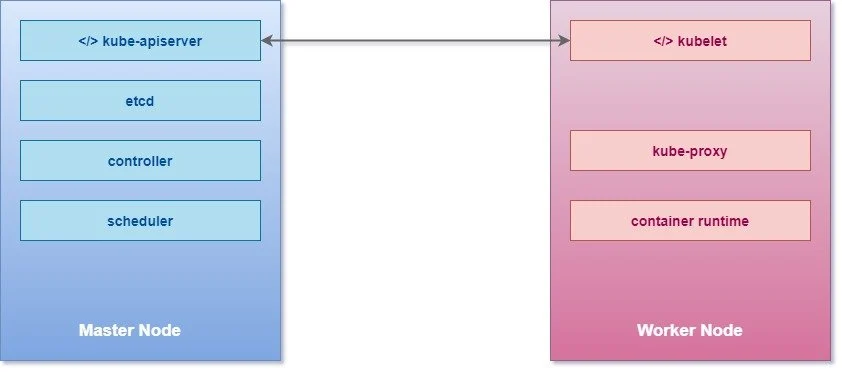

# Kubernetes Components

* A **Kubernetes Cluster** consists of Master and Client node setup where we will have one Master or **Controller** node along with multiple Client nodes also referred as **worker** nodes or in minions.
* A **Master** is a node with Kubernetes installed and is responsible for the actual orchestration of containers on the worker nodes. It will contain all the information of cluster nodes, monitor each node and if a worker node fails then it will move the workload from the failed node to another worker node.

\

.png>)

* A **Node** is a worker machine which can be a physical or virtual machine on which Kubernetes is installed.
* Kubernetes does not deploy containers directly into the worker nodes, the containers are encapsulated into a Kubernetes object known as **Pods**.
* A pod is a single instance of an application and they are the smallest deployable units of computing that you can create and manage in Kubernetes.
* You will deploy containers inside these pods where you will deploy your application

Following is a basic architectural diagram of Kubernetes and the relationship between containers, pods, and physical worker nodes which were referred as Minion in past.

.png>)

### Kubernetes Cluster

\
There are three main components in the Kubernetes Cluster i.e. Nodes, Pods and Containers. We have already learned about containers in depth so I will cover the remaining components here:

#### Master

* The master is the control plane of Kubernetes.
* It consists of several components, such as an API server, a scheduler, and a controller manager.
* The master is responsible for the global state of the cluster, cluster-level scheduling of pods, and handling of events. Usually, all the master components are set up on a single host.
* When considering high-availability scenarios or very large clusters, you will want to have master redundancy.

&#x20;

#### Nodes (Minion)

* You can think of these as container clients.
* These are individual hosts (physical or virtual) on which Docker would be installed to host different containers within your managed cluster
* Each Node will run ETCD (key pair management and communication service, used by Kubernetes for exchanging messages and reporting Cluster status) as well as the Kubernetes proxy

&#x20;

#### Pods

* A Pod is a group of one or more containers, with shared storage/network resources, and a specification for how to run the containers.
* We’re not implying that a pod always includes more than one container—it’s common for pods to contain only a single container.
* The key thing about pods is that when a pod does contain multiple containers, all of them are always run on a single worker node—it never spans multiple worker nodes
* These containers are guaranteed (by the cluster controller) to be located on the same host machine in order to facilitate sharing of resources
* Pods are assigned unique IP address within each cluster. These allow an application to use ports without having to worry about conflicting port utilization
* Pods can contain definitions of disk volumes or share and then provide access from those to all the members (containers) with the pod.

### Kubernetes Components

When you are installing Kubernetes, basically you are working with following components:

#### API Server

* The API server acts as a frontend for Kubernetes
* It can easily scale horizontally as it is stateless and stores all the data in the etcd cluster.
* The users, management devices, command line interfaces, all talk to API server to interact with Kubernetes cluster

&#x20;

#### etcd key store

* It is a distributed reliable key value store
* Kubernetes uses it to store the entire cluster state
* In a small, transient cluster a single instance of etcd can run on the same node with all the other master components.
* But for more substantial clusters, it is typical to have a three-node or even five-node etcd cluster for redundancy and high availability.
* It is responsible for implementing locks within the clusters to ensure that there are no conflicts between the masters

&#x20;

#### Scheduler

Kube-scheduler is responsible for scheduling pods into nodes. This is a very complicated task as it needs to consider multiple interacting factors, such as the following:

* Resource requirements
* Service requirements
* Hardware/software policy constraints
* Node affinity and anti-affinity specifications
* Pod affinity and anti-affinity specifications
* Taints and tolerations
* Data locality
* Deadlines

&#x20;

#### Controllers

* The controllers are the brain behind Orchestration.
* They are responsible for noticing and responding when Nodes, containers or end points goes down
* The controller makes decision to bring up new containers in such case

&#x20;

#### Controller Runtime

It is the underlying software that is used to run containers. In our case we will be using Docker as the underlying container but there are other options as well such as:

* Docker (via a CRI shim)
* rkt (direct integration to be replaced with Rktlet)
* CRI-O
* Frakti (Kubernetes on the Hypervisor, previously Hypernetes)
* rktlet (CRI implementation for rkt)
* CRI-containerd

The major design policy is that Kubernetes itself should be completely decoupled from specific runtimes. The **Container Runtime Interface (CRI)** enables it.

&#x20;

#### kubelet

It is the agent that runs on each nodes in the cluster. The agent is responsible for making sure that the containers are running on the nodes as expected. That includes the following:

* Receiving pod specs
* Downloading pod secrets from the API server
* Mounting volumes
* Running the pod's containers (via the configured runtime)
* Reporting the status of the node and each pod
* Running the container startup, liveness, and readiness probes

&#x20;

#### kube-proxy

* Kube-proxy does low-level network housekeeping on each node
* Containers run on the server nodes, but they interact with each other as they are running in a unified networking setup.
* kube-proxy makes it possible for containers to communicate, although they are running on different nodes.
* It reflects the Kubernetes services locally and can perform TCP and UDP forwarding.
* It finds cluster IPs via environment variables or DNS.

### Conclusion

In this Kubernetes tutorial we learned how applications have changed in recent years and how they can now be harder to deploy and manage. You’ve learned that:

* Linux containers provide much the same benefits as virtual machines, but are far more lightweight and allow for much better hardware utilization.
* Docker improved on existing Linux container technologies by allowing easier and faster provisioning of containerized apps together with their OS environments.
* Kubernetes exposes the whole datacenter as a single computational resource for running applications.
* Developers can deploy apps through Kubernetes without assistance from sysadmins.
* Sysadmins can sleep better by having Kubernetes deal with failed nodes automatically.
